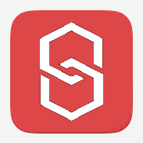

<div align="center">



# Rechard

> A simple blockchain implemented by Rescript

</div>

## Introduction

This is a project for teaching or learning, you can learn about rescript while learning the basic concepts of blockchain.

- [ReScript](https://rescript-lang.org/) is a robustly typed language that compiles to efficient and human-readable JavaScript. It comes with a lightning fast compiler toolchain that scales to any codebase size.

- [Blockchain](https://en.wikipedia.org/wiki/Blockchain) is a distributed ledger with growing lists of records (blocks) that are securely linked together via cryptographic hashes

## Build and Run

This project is managed by [pnpm](https://pnpm.io/), you can also use npm.

`package.json:`
```json
"scripts": {
    "build": "rescript",
    "clean": "rescript clean",
    "dev": "rescript build -w",
    "start": "rescript && node src/Main.bs.js"
},
```

To see the effect, just run `npm run start`.

## Materials
These materials can help you understand the source code of this project, and more ways to use JavaScript to build blockchains or cryptocurrencies:

__Project__:
- [naivechain](https://github.com/lhartikk/naivechain):  A blockchain implementation in 200 lines of code 
- [blockchain-in-js](https://github.com/nambrot/blockchain-in-js):  Build your own blockchain! 
- [SavjeeCoin](https://github.com/Savjee/SavjeeCoin):  A simple blockchain in Javascript. For educational purposes only.

__Article__:
- [Learn & Build a Javascript Blockchain](https://medium.com/@spenserhuang/learn-build-a-javascript-blockchain-part-1-ca61c285821e)
- [How To Launch Your Own Production-ready Cryptocurrency](https://hackernoon.com/how-to-launch-your-own-production-ready-cryptocurrency-ab97cb773371)

__Video__:
- [SavjeeCoin Video Tutorial](https://www.youtube.com/watch?v=zVqczFZr124)

## LICENSE
The MIT License (MIT)

Copyright (c) 2022 Muqiu Han

Permission is hereby granted, free of charge, to any person obtaining a copy
of this software and associated documentation files (the "Software"), to deal
in the Software without restriction, including without limitation the rights
to use, copy, modify, merge, publish, distribute, sublicense, and/or sell
copies of the Software, and to permit persons to whom the Software is
furnished to do so, subject to the following conditions:

The above copyright notice and this permission notice shall be included in all
copies or substantial portions of the Software.

THE SOFTWARE IS PROVIDED "AS IS", WITHOUT WARRANTY OF ANY KIND, EXPRESS OR
IMPLIED, INCLUDING BUT NOT LIMITED TO THE WARRANTIES OF MERCHANTABILITY,
FITNESS FOR A PARTICULAR PURPOSE AND NONINFRINGEMENT. IN NO EVENT SHALL THE
AUTHORS OR COPYRIGHT HOLDERS BE LIABLE FOR ANY CLAIM, DAMAGES OR OTHER
LIABILITY, WHETHER IN AN ACTION OF CONTRACT, TORT OR OTHERWISE, ARISING FROM,
OUT OF OR IN CONNECTION WITH THE SOFTWARE OR THE USE OR OTHER DEALINGS IN THE
SOFTWARE.